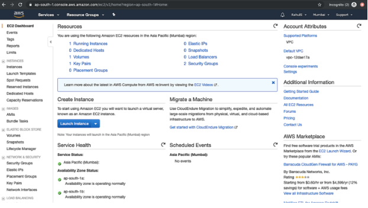
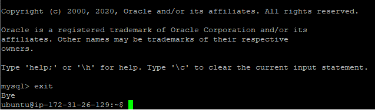

# **STEPS TO CREATE AN EC2 INSTANCE**

* Login to AWS using your login details


* Once you login into AWS successfully, you will see the main console with all the service listed as follows.


* Before proceeding with the creation of an EC2 instance, Select the desired and closest region to you.


* Click on **"Services"** at the upper left corner and you will see the following screen with all the Services available on AWS. Click on **"EC2"** available under **"Computer".**


* To create an Instance, Click on "Launch Instance."



* Launch a new "EC2" instance of t2.micro family with Ubuntu Server 20.04 LTS(HVM)


* Click on Next: Configure Instance Details to begin your Ubuntu's Server Configuration.


* Next: Add Storage; to add or configure the Storage size and type.


* Next: Add Tags. This gives you the opion to add a tag to your EC2 Instance.


* Click Next: Configure Security Group; to configure and set the rules as to what is allowed to connect outbound and inbound in our EC2 Instance.


* Next: Click on Preview and Lauch.


* On the next page, Click on "Launch" to Launch the Ubuntu 20.04 LTS(HVM).


* Before the Instance creation starts, we need to select a key pair which is then required to take SSH access to the Server.

* To create a new key-pair, Select "Create a new key-pair" from the drop down menu, give a name to the key-pair and download it. Keep the pair at a safe place.

* As for me, I already created a key-pair, so I selected "Choose an existing key-pair"


* Wait for some time until the instance gets created. Click on "View Instance" to check the Instance State and other details.


* Once the Instance State changes from "Pending" to "Running" you can connect to the Instance.


# **CONNECT AND CONVERT PRIVATE KEY**
* Once the Instance is available, Select the Instance and Click on "Connect". Copy the SSH Command to connect to the Instance.


* ### _CONVERT PRIVATE KEY USING PUTTYgen :_
   * From the Start menu, Choose All Programs, PUTTY, PUTTYgen. Under Type of Key to generate, Choose RSA. If your version of PUTTYgen does not include this progam, Choose SSH-2 RSA.

   

   * Choose Load. By default, PuTTYgen displays only files with the extension _**.ppk**_. 
   * To locate your _**.pem**_ file, Choose the option to display files to all types

   

   * Select your **_.pem_** file for the key pair that you specified when you launched your Instance and Choose **Open**. PuTTYgen displays a notice that the **_.pem_** file was successfully imported. Choose OK.
   * To save the key in the format that PuTTY can use, Choose Save Private Key. PuTTYgen displays a warning about saving the key without a passphrase. Choose Yes.
   * >**NOTE :** A passphrase on a private key is an extra layer of protection. Even if your private key is discovered, it can't be used without the passphrase. The downside to using a passphrase is that it makes automation harder because human intervention is needed to log on to an Instance, or to copy files to an Instance.
   * Specify the same name for the key that you used for the key pair and choose Save.
   * PuTTY automatically adds the **_.ppk_** file extension. Your Private key is now in the correct format for use with PuTTY. You can now connect to your Instance using PuTTY's SSH Client.

## CONNECT USING PUTTY
* On the Start menu, Choose All Programs, PuTTY, PuTTY. In the Category pane, Choose session and complete the following fields:

  * For Host name, Enter: **ec2-user@public_dns_name**
  > Note: You can get the public DNS for your Instance using the Amazon EC2 Console(If the public DNS column is hidden, Choose the Show/Hide icon).
  * For connection type, Choose SSH
  * For port, ensure that the value is **22**
  

* In the Category pane, Choose Connection, SSH, and Auth. Complete the following:

  * Choose Browse, Select the **_.ppk_** file that you generated for your key pair, and then Choose Open.
  * Choose Open to start the PuTTY Session

  

* If this is the first time you have connected to this Instance, PuTTY displays a Security alert dialog box that asks whether you trust the host you are connecting to. Choose Yes.
* A window opens and you are connected to your Instance.

**Congratulations**, our Linux Server and set up in the Cloud looks like this now.


# **LAMP STACK IMPLEMENTATION IN AWS**

## **The Four Layers of a LAMP Stack**
Linux based web servers consist of four software components. These components, arranged in layers supporting one another, make up the software stack. Websites and Web Applications run on top of this underlying stack. The common software components that make up a traditional LAMP stack are:

**Linux:** 
The operating system (OS) makes up our first layer. Linux sets the foundation for the stack model. All other layers run on top of this layer.

**Apache:** 
The second layer consists of web server software, typically Apache Web Server. This layer resides on top of the Linux layer. Web servers are responsible for translating from web browsers to their correct website.

**MySQL:** 
Our third layer is where databases live. MySQL stores details that can be queried by scripting to construct a website. MySQL usually sits on top of the Linux layer alongside Apache/layer 2. In high end configurations, MySQL can be off loaded to a separate host server.

**PHP:** 
Sitting on top of them all is our fourth and final layer. The scripting layer consists of PHP and/or other similar web programming languages. Websites and Web Applications run within this layer.

* We can visualize the LAMP stack like so:


## **STEP 1 - Installing Apache and Updating the Firewall**
* Apache HTTP Server is the most widely used web server software. Developed and maintained by Apache Software Foundation. Apache is an open source software available for free. It is fast, reliable, and secure. It can be highly customized to meet the needs of many different environments by using extensions and modules.

* Install Apache using Ubuntu's package manager **'apt'**

```Bash
$ sudo apt update

$ sudo apt install apache2
```

* To verify that apache2 is running as a service in our OS, use the following command.

```Bash
$ sudo systemctl status apache2
```
**see my output:**


* We need to configure our firewall settings to allow HTTP traffic. UFW has different application profiles that we can leverage for accomplishing that. To list all currently available UFW application profile, **run:**

```Bash
$ sudo ufw app list
```
_**see my output:**_


_Available applications:_
* Apache: This profile opens only port 80(normal, encrypted web traffic)
* Apache Full: The profile opens port 80(normal encrypted web traffic) and port 443(TLS/SSL encrypted traffic)
* Apache Secure: This profile open port 443(TLS/SSL encrypted traffic)

* To only allow HTTP traffic on port 80, **run:**

```Bash
$ sudo ufw allow ssh
$ sudo ufw allow http
$ sudo ufw enable
```

* And we can verify the change with:

```Bash
$ sudo ufw status
```

_**see my output:**_


* To verify and check that we can access it locally in our ubuntu shell and from the internet, **run:**

```Bash
$ curl http://localhost:80
or
$ curl http://127.0.0.1:80
```

* As an output you can see some strangely formatted test, do not worry, we just made sure that our Apache web service responds to 'curl' command with some payload.
Open a web browser of your choice and try to access the following URL:

```
http://<Public-ip-address>:80
```

* Another way to retrieve your Public IP address, other than to check it in AWS Web Console, is to use the following command.
```Bash
$ curl -s http://169.254.169.254/latest/meta-data/public-ipv4
```
* If you see the following page, then your web server is now correctly installed and accessible through your firewall.
_**see my output:**_


## **STEP 2 - Installing MySQL**
* We need to install the database system to be able to store and manage data for our website. MySQL is a popular database management system used within PHP environments.
* To install mysql-server, **run:**

```Bash
$ sudo apt -y install mysql-server
```

* After the installation it is recommended that we run a security script that comes pre-installed with MySQL. This script will remove some insecure default settings and lockdown access to our database system.
* Start the interactive Script by running:

```Bash
$ sudo mysql_secure_installation
```
* This will ask if you want to configure the VALIDATE PASSWORD PLUGIN. Answer **Y** for yes, or anything else to continue without enabling.

_**see my output:**_


* If you answer "yes", you'll be asked to select a level of password validation. Keep in mind that if you enter **2** for the strongest level, you will receive errors when attempting to set any password which does not contain number, upper and lowercase letters, and special characters, or which is based on common dictionary words.
* If you enabled password validation, you'll be shown the password strength for the root password you just entered and your server will ask if you want to continue with that password. If you are happy with your current password, enter 'Y' for 'yes' at the prompt.
* When you're finished, test if you're able to login to the MySQL Console by typing:
```Bash
$ sudo mysql
```


* To exit the MySQL Console, type: **exit**



* For increased security, it's best to have dedicated user accounts with less expansive priviledges set up for every database, especially if you plan on having multiple database hosted on your server.
* MySQL Server is now installed and secured. Next, we will install PHP, the final component in the LAMP Stack.

# **STEP 3 - Installing PHP**
* We have Apache installed to serve our content and MySQL installed to store and manage our data. PHP is the component of our setup that will process code to display content to the end user. In addition to the PHP Package, we need **php-mysql**, a PHP module that allows PHP to communicate with MySQL based databases. We also need **libapache2-mod-php** to enable Apache to handle PHP files. Core php packages will automatically be installed as dependencies.
* To install these 3 packages at once, **run:**
```Bash
$ sudo apt install php libapache2-mod-php php-mysql
```
* After installation, run the following command to confirm our PHP Version: **php -v**

_**see my output**_


* At this point your Lamp Stack is completely installed and fully operational. To test our setup with a PHP Script, it's best to setup a proper Apache Virtual Host to host our website's file and folders.
* Virtual Host allows you to have multiple websites located on a single machine and users of the websites will not even notice it.
* We will configure our first Virtual Host in the next step.

# **STEP 4 - Creating a Virtual Host for your website using Apache**
* In this project, you will set up a domain called ProjectLamp. Apache on Ubuntu 20.04 has one server block enabled by default that is configured to serve to serve documents from the **/var/www/html** directory.
* We will leave this configuration as is and will add our own directory next to the default one.
* To create the directory, **run:**

```Bash
$ sudo mkdir /var/www/projectlamb
```

* Next, assign ownership of the directory with the $USER environment variable, which will reference your current user.
* **Example :**

```Bash
$ sudo chown -R $USER:USER /var/www/projectlamp
```
* **My Input :**

```Bash
$ sudo chown -R ubuntu:ubuntu /var/www/projectlamp
```
* Then, create and open a new configuration file in Apache's sites-available directory using your prefered command-line editor. Here, we'll be using vi or vim.
```Bash
$ sudo vi /etc/apache2/sites-available/projectlamp.conf
```
* This will create a new blank file. Paste in the following bare-bone configuration.
* **_see my configuration_ :**


* To save and close the file, simply hit the **"esc"** button on the keyboard, type **" : "**, type **" wq "**, hit **ENTER** to save the file.
* You can use the **ls** command to show the new file in the sites-available directory.
```Bash
$ sudo ls /etc/apache2/sites-available
```
* _**see my output**_


* With this Virtual Host configuration, we're telling Apache to serve ProjectLamp using **/var/www/projectlamp** as its web root directory. If you would like to test Apache without a domain name, you can remove or comment out the options **ServerName** and **ServerAlias** by adding a (**#**) character in the beginning of each option's lines. Adding the **#** character there will tell the program to skip processing the instructions on those lines.
* You can now use **"a2ensite"** command to enable the new Virtual Host : 

```Bash
$ sudo a2ensite projectlamp
```


* You might want to disable the default the default website that comes installed with Apache. This is required if you're not using a custom domain name, because in this case Apache's default configuration would overwrite your Virtual Host.
* To disable Apache's default website use **"a2dissite"** command, type :
```Bash
$ sudo a2dissite 000-default
```


* To make sure your configuration file doesn't contain syntax errors, **run :**

```Bash
sudo apache2ctl configtest
```


* Finally, reload Apache so these changes take effect:

```Bash
$ sudo systemctl reload apache2
```
* Our website is now active, but the web root **/var/www/projectlamp** is still empty. Create an index.html file in that location so that we can test that the Virtual Host works as expected.
* Type and **run :**

```Bash
$ sudo vi /var/www/projectlamp/index.html
```
_**see my input :**_


* Now go to your b
rowser and try to open your web site URL using the IP address:
```Bash
http://<public-ip-address>:80
```
* To check your Public IP from the Ubuntu shell, **run :**
```Bash
curl -s http://169.254.169.254/latest/meta-data/public-ipv4
```
_**see my output :**_


**It works!**

# **STEP 5 - Enable PHP on The Website**
* With the default **DirectoryIndex** settings in Apache, a file named **index.html** will always take precedence over an **index.php** file. This is useful for setting up maintenance pages in PHP applications, by creating a temporary index.html file containing an informative message to visitors. Because this page will take precedence over the **index.php**, it will then become the landing page for the application.
* Once maintenance is over, the index.html is renamed or removed from the document root, bringing back the regular application page.
* In case you want to change this behaviour you'll need to edit the **/etc/apache2/mods-enable/dir.conf** file and change the order in which the index.php file is listed within the **DirectoryIndex** directive :
```Bash
$ sudo vim /etc/apache2/mods-enable/dir.conf
```
_**see my input :**_


* After saving and closing the file, you will need to reload Apache so that the changes take effect:
```Bash
$ sudo systemctl reload apache2
```
* Finally, we will create a PHP Script to test the PHP is correctly installed and configured on our Server.
* Now that we have a custom location to host our website's files and folders, we'll create a PHP test script to confirm that Apache is able to handle and process requests for PHP files.
* Create a new file named **index.php** inside our custom web root folder:
```Bash
$ vim /var/www/projectlamp/index.php
```
* This will open a blank file. Add the following text, which is valid PHP Code, inside the file :
```PHP
<?php
phpinfo();
```


* When you are finished, save and close the file, refresh the page and you will see a page similar to this :


* This page provides so much details about your installation and may pose a security risk, and you may have to remove it with the **rm** command.
* To remove this page, **run :**
```Bash
$ sudo rm /var/www/projectlamp/index.php
```
_**CONGRATULATIONS**_

**Credits :**

1. [https://starter-pbl.darey.io/en/latest/project1.html
](https://starter-pbl.darey.io/en/latest/project1.html
)

1. [ https://docs.aws.amazon.com/AWSEC2/latest/UserGuide/putty.html]( https://docs.aws.amazon.com/AWSEC2/latest/UserGuide/putty.html)

1. [https://docs.aws.amazon.com/quickstarts/latest/vmlaunch/step-2-connect-to-instance.html
](https://docs.aws.amazon.com/quickstarts/latest/vmlaunch/step-2-connect-to-instance.html)

1. [https://www.howtoforge.com/how-to-create-an-ec2-instance-on-aws/](https://www.howtoforge.com/how-to-create-an-ec2-instance-on-aws/)

1. [https://www.liquidweb.com/kb/what-is-a-lamp-stack/](https://www.liquidweb.com/kb/what-is-a-lamp-stack/)

1. [https://www.youtube.com/watch?v=f52IOtTqcP8](https://www.youtube.com/watch?v=f52IOtTqcP8)

1. [https://www.youtube.com/watch?v=bi7ow5NGC-U](https://www.youtube.com/watch?v=bi7ow5NGC-U)

